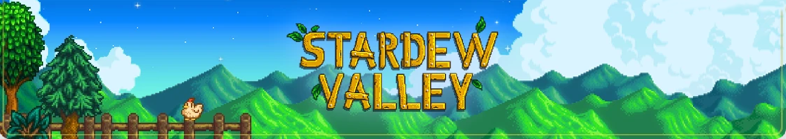
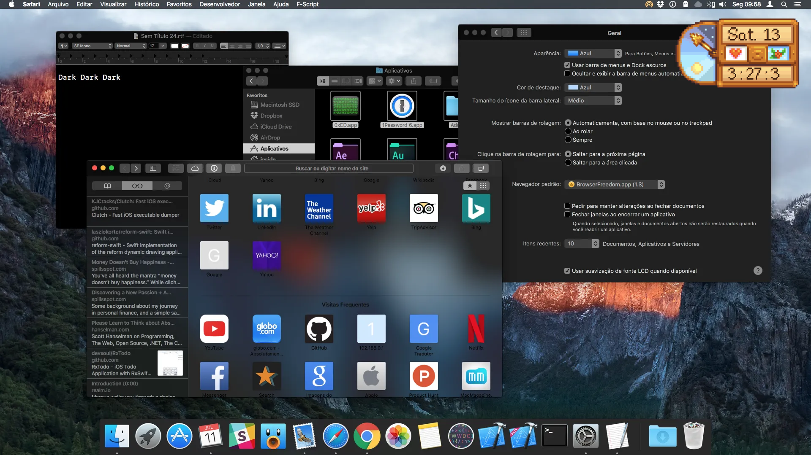

  

# Welcome to the valley!

## Checklist

- [x] Shows the time
- [x] Shows the date
- [x] Always on top
- [ ] Current weather status
- [ ] Window spawn on top-right of screen
- [ ] Icons
- [ ] Proper packaging
- [ ] Night / day icon


## Building
```npm i```  
```npm start``` for local

#### Follow below commands for platform specific builds or pass ```--all``` to ```electron-packager``` to build for all platforms.

## Mac Build



#### Builing for Mac ```electron-packager . --platform darwin```


## Win Build


#### Builing for Windows ```electron-packager . --win32 darwin```


## Linux Build


#### Builing for Linux ```electron-packager . --linux darwin```

### [Buy Stardew Valley](https://www.stardewvalley.net/)
### [Font used](https://fontstruct.com/fontstructionsshow/1254619/stardew_valley)